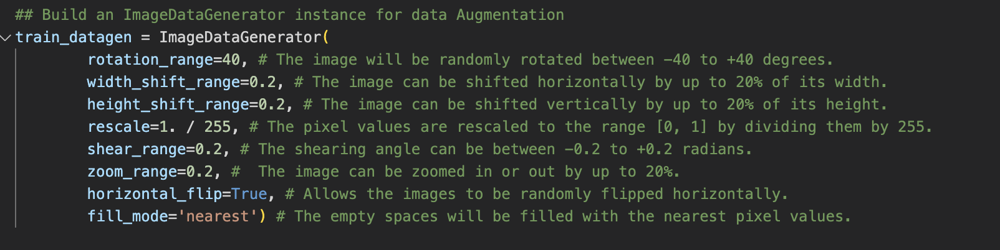
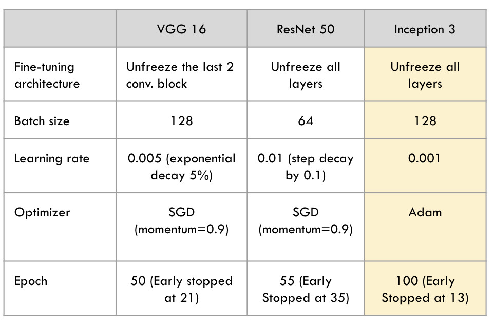

# Image-Recognition
This project focuses on developing a robust food detection system using deep learning models, including InceptionV3, ResNet50, and VGG16 with existing Food101 dataset. 

## Data Preparation
### Dataset
The food101 dataset, which is a pre-labelled dataset with 101 food  categories consisting of 1000 images in each category, is chosen to be the primary dataset for model training and testing regardless of a few key factors. 

The project started from the partitioned dataset (Dataset Folder) with only 5 class items to validate that the chosen model architecture and approach are suitable for the task before scaling up to the full dataset. It contains 5 classes with 1000 images each, which includes apple pie, cannoli, dumplings, sushi and miso soup. 

Full Dataset Download Link:
https://www.kaggle.com/datasets/dansbecker/food-101
### EDA
- Visual inspection of food images, analysis of food classes and listing of other dataset specs from the collected dataset.

- Explores the image resolutions by iterating through each class to assess the image shapes and their colour channels

### Data Augmentation

- Image Rotation
- Horizontally/Vertically Shift
- Image Rescale
- Zooming and horizontal flip

## Model Development
- InceptionV3 (73.3%)
- VGG16 (77.6%)
- Resnet50 (78.1%)

## Evaluation
- Accuracy 
- Precision
- Recall 
- F1-score
- Confusion matrix

